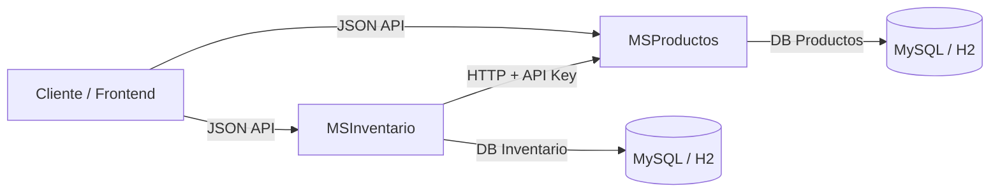

## Sistema de Microservicios - Productos e Inventario
Este proyecto implementa un sistema de gestión de productos e inventario utilizando Spring Boot + JPA + MySQL/H2, siguiendo un enfoque de microservicios.

## 1. Microservicios
  a. MSProductos
   -Gestión de productos.
   -Endpoints para crear, consultar y listar productos.
   -Base de datos propia (productos_db).
  a. MSInventario
   -Gestión de inventario y compras.
   -Consulta y actualización del stock de productos.
   -Comunicación con MSProductos vía HTTP + API Key.
   -Base de datos propia (inventario_db).
   
## 2. Arquitectura

-Comunicación entre microservicios por HTTP/JSON.
-Autenticación básica con API Key.
-Manejo de timeout y reintentos en el cliente REST.

## 3. Tecnologías
    - Java 17
    - Spring Boot 3.3.4
    - Maven 3.9.x
    - H2 Database (solo desarrollo)
    - Spring Data JPA
    - Spring Web
    - Lombok
    - Swagger / OpenAPI
    - JUnit 5

## 4. Documentación API
Swagger habilitado en ambos servicios:
MSProductos → http://localhost:8080/swagger-ui.html
MSInventario → http://localhost:8081/swagger-ui.html

## 5. Endpoints principales
a. MSProductos
    -Crear Producto
            POST /productos

            Headers: X-API-KEY (opcional)

            Body:

            {
            "nombre": "Producto 1",
            "precio": 10000,
            "descripcion": "Descripción del producto"
            }

            Respuesta:

            {
            "data": {
                "type": "producto",
                "id": "1",
                "attributes": {
                "nombre": "Producto 1",
                "precio": 10000,
                "descripcion": "Descripción del producto"
                }
            }
            }

    -Obtener Producto por ID

            GET /productos/{id}

            Respuesta:

            {
            "data": {
                "type": "producto",
                "id": "1",
                "attributes": {
                "nombre": "Producto 1",
                "precio": 10000,
                "descripcion": "Descripción del producto"
                }
            }
            }

    -Listar Productos

                GET /productos

b. MSInventario
    -Consultar inventario de un producto

            GET /inventario/{productoId}

            Respuesta:

            {
            "productoId": 1,
            "cantidad": 50
            }

            Si el producto no existe:

            {
            "error": "Producto no encontrado en inventario"
            }

    -Actualizar inventario

        PUT /inventario/{productoId}

        Body:

        {
        "cantidad": 100
        }

        Respuesta:

        {
        "productoId": 1,
        "cantidad": 100
        }

    -Registrar compra

        POST /inventario/compra/{productoId}

        Body:

        {
        "cantidad": 5
        }

    Validaciones:

    Verifica que el producto exista en MSProductos.

    Valida que el stock sea suficiente.

    Descarta la cantidad comprada del inventario.

    Respuesta exitosa:

    {
    "productoId": 1,
    "cantidad": 45
    }

## 6. Seguridad (API Key)
La comunicación entre MSInventario → MSProductos utiliza autenticación con API Key.
Agregar en el application.yml de ms-inventario:
msproductos:
  url: http://localhost:8080
  apikey: my-secret-key

## 7.Testing
Se incluyen pruebas unitarias y de integración:
a. MSProductos
    Creación de productos.
    Consulta de productos.

b. MSInventario
    Gestión de inventario.
    Proceso de compra (incluye comunicación con MSProductos).
    Manejo de errores:
    Producto no encontrado.
    Inventario insuficiente.

## 8 Requisitos
    - JDK 17
    - Maven 3.x
    - PowerShell, Terminal o CMD en Windows
    - IDE recomendado: Visual Studio Code o IntelliJ IDEA

Autor: Jonnattan Arley González Ruiz
Versión: 1.0.0

